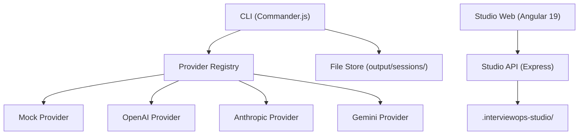

# InterviewOps

> Local-first AI interview practice for developers who want to build real skill.

[](https://github.com/AnkitParekh007/interview-ops/actions)
[](LICENSE)
[](https://nodejs.org)
[](CONTRIBUTING.md)

InterviewOps is an open-source CLI and Angular web app that runs structured mock interviews on your machine — no account, no subscription, no API key required. It generates questions calibrated to your track and mode, scores your answers against a rubric, and writes a complete session packet to disk for review.

**[Try it in 60 seconds](#try-it-in-60-seconds) · [Architecture](docs/architecture.md) · [Provider system](docs/provider-system.md) · [Contributing](CONTRIBUTING.md)**

---

## What this proves

For recruiters and hiring managers: this project demonstrates deliberate, production-quality engineering decisions across multiple disciplines.

- **Provider abstraction pattern** — `InterviewProvider` interface with a factory registry; four providers (mock, OpenAI, Anthropic, Gemini) swapped via a single env var, no code changes required
- **Zod schema validation** — full config schema with typed defaults, validated at startup; no runtime config surprises
- **TypeScript strict mode** — `noImplicitAny`, `strictNullChecks` throughout; no `any` without explicit justification
- **CLI UX design** — Commander.js command tree, ora spinners, chalk-colored output, helpful error messages with recovery steps
- **Angular 19** — standalone components, Signals (`signal`, `computed`, `effect`), RxJS for async data, OnPush change detection
- **Local-first architecture** — all session data written to `output/sessions/` on disk; Studio data in `.interviewops-studio/`; no cloud backend dependency
- **Ethics-by-design** — ethics constraints encoded in Zod config schema with defaults locked to `true`; banned phrases tested in `ethics.test.ts`; `ethics-notice.md` required in every session output
- **Content system design** — tracks, modes, and rubrics defined as Markdown files; loaded and validated at runtime; fully extensible without touching application code
- **GitHub Actions CI** — Node 20 and 22 matrix; builds CLI, runs tests, builds Studio API and Studio Web on every PR

---

## Why developers use this

- **Free to run** — mock provider requires no API key and generates realistic, structured content
- **Runs locally** — your resume, job description, and answers never leave your machine
- **Role-specific questions** — 9 tracks calibrated to real roles (Angular developer, AI agentic engineer, engineering manager, etc.)
- **Rubric-based scoring** — 9 rubrics with named dimensions (not a generic "score out of 10")
- **Actionable feedback** — strengths, gaps, improved answer examples, and a 2-week study plan per session
- **BYOK model** — bring your own OpenAI, Anthropic, or Gemini key for higher-quality responses when you want them
- **Honest about what it is** — a practice tool, not a cheating tool

---

## Try it in 60 seconds

```bash
git clone https://github.com/AnkitParekh007/interview-ops.git
cd interview-ops
npm install
npm run demo
```

Expected output (abbreviated):

```
InterviewOps Doctor
  Node.js version      20.x.x
  Config file          config/interviewops.yml
  .env file            .env
  Tracks directory     tracks/ (9 found)
  Modes directory      modes/ (13 found)
  Rubrics directory    rubrics/ (9 found)
  Provider             mock (available, no API key required)
  Setup complete.

Running simulation: senior-frontend / behavioral (mock provider)
  Generating interview session...
  Writing session files...
  Session written to output/sessions/2026-05-14-senior-frontend-behavioral/

Session files created:
  session.md
  questions.md
  scorecard.md
  feedback.md
  improved-answers.md
  study-plan.md
  ethics-notice.md
  metadata.json

Demo complete.
```

To run a specific track and mode:

```bash
npm run simulate -- --track angular-developer --mode frontend-architecture
npm run simulate -- --track ai-agentic-engineer --mode ai-assisted-engineering
npm run plan -- --resume input/resume.example.md --job input/job-description.example.md
```

---

## Features

| Feature | Detail |
|---------|--------|
| Interview tracks | 9 — junior-frontend, senior-frontend, angular-developer, react-developer, fullstack-developer, ai-frontend-engineer, ai-agentic-engineer, devrel-engineer, engineering-manager |
| Interview modes | 13 — behavioral, coding, system-design, frontend-architecture, angular, react, project-deep-dive, debugging, code-review, ai-assisted-engineering, take-home-review, recruiter-screen, candidate-questions |
| AI providers | 4 — mock (default, no key), OpenAI, Anthropic, Gemini |
| Rubric scoring | 9 rubrics, 1–5 scale, hire signal per session |
| Session output | 8 files per session (questions, scorecard, feedback, improved answers, study plan, ethics notice, full session, metadata) |
| Prep plans | Resume + JD gap analysis, 2-week day-by-day schedule |
| STAR story bank | Store and retrieve behavioral stories in Studio |
| Readiness reports | Hire signal, weakness map, top actions (Studio) |
| Studio UI | Angular 19 web app with chat interface, avatar coach, session history |
| Local-first | All data on disk, no cloud required |
| Ethics guardrails | Practice-only mode; cheating features blocked in config and tested |
| CI | GitHub Actions, Node 20 + 22 matrix |

---

## Architecture overview



The CLI is fully self-contained. The Studio web app is a separate Angular project that communicates with a local Express API. The two subsystems are independent — the CLI works without Studio running.

See [docs/architecture.md](docs/architecture.md) for the full technical architecture.

---

## Demo walkthrough

Run `npm run demo` to execute the full pipeline end-to-end using the mock provider. The demo runs:

1. `doctor` — validates Node version, config file, tracks/modes/rubrics directories, provider availability
2. `examples` — copies example input files to `input/`
3. `simulate` — runs a `senior-frontend` / `behavioral` session
4. `plan` — generates a prep plan from the example resume and job description
5. `verify` — validates that all required files exist, ethics notice is present, no banned phrases appear

All steps use the mock provider. No API key is required. Output is written to `output/sessions/` and `output/plans/`.

---

## Tracks and Modes

### Tracks

| Track | Target role |
|-------|-------------|
| `junior-frontend` | 0–2 years, HTML/CSS/JS fundamentals |
| `senior-frontend` | 5–10 years, architecture, Core Web Vitals, TypeScript |
| `angular-developer` | Angular specialist: Signals, RxJS, OnPush, NgRx |
| `react-developer` | React specialist: hooks, RSC, React Query, testing |
| `fullstack-developer` | Full system ownership: API design, DB, deployment |
| `ai-frontend-engineer` | AI product UX: streaming, tool-call rendering, AI SDKs |
| `ai-agentic-engineer` | Agent systems: ReAct, RAG, MCP, function calling, safety |
| `devrel-engineer` | Developer relations: technical communication, content, community |
| `engineering-manager` | People leadership, delivery, technical strategy |

### Modes

| Mode | What it simulates |
|------|-------------------|
| `recruiter-screen` | 20–30 min recruiter call |
| `behavioral` | STAR-format behavioral interview |
| `coding` | Algorithm and TypeScript coding round |
| `system-design` | High-level architecture discussion |
| `frontend-architecture` | Component, state, perf, accessibility |
| `angular` | Angular-specific technical interview |
| `react` | React-specific technical interview |
| `project-deep-dive` | Past project storytelling and depth |
| `debugging` | Systematic debugging process |
| `code-review` | Reading and critiquing unfamiliar code |
| `ai-assisted-engineering` | AI tools: prompting, validation, ethics |
| `take-home-review` | Walk through and defend a take-home |
| `candidate-questions` | Practice questions to ask the interviewer |

---

## Studio

InterviewOps Studio is the local Angular web application for a chat-based interview practice experience.

```bash
npm run studio
```

Starts:
- Studio API at `http://localhost:4317`
- Studio Web at `http://localhost:4200`

Features: chat interface, animated avatar coach, session history, readiness reports, STAR story bank, progress dashboard, prep plan viewer, export to Markdown.

> Screenshot placeholder — Studio chat interface

> Screenshot placeholder — Readiness report with hire signal

See [docs/architecture.md](docs/architecture.md) for the Studio architecture details.

---

## Contributing

Contributions are welcome. The easiest way to contribute is to add a new track, mode, or rubric — each is a Markdown file with a defined structure.

```bash
npm test        # Must pass before any PR
npm run build   # TypeScript must compile
npm run demo    # Full pipeline must complete
```

See [CONTRIBUTING.md](CONTRIBUTING.md) for:
- How to add a provider (6 steps)
- How to add a track
- How to add a mode
- How to add a rubric
- Code style expectations
- PR process

Good first issues are labeled in the [GitHub issue tracker](https://github.com/AnkitParekh007/interview-ops/issues).

---

## Ethics

InterviewOps is built for **practice before interviews**, not assistance during them.

What it will not do: live answer injection, hidden screen overlays, screen-share evasion, stealth mode, real-time cheating assistance.

Every session output includes an `ethics-notice.md` file. Ethics constraints are enforced in the Zod config schema (defaults locked to `true`) and tested in `tests/ethics.test.ts`.

[Read the full ethics policy](ETHICS.md) · [Technical ethics boundaries](docs/ethical-ai-boundaries.md)

---

## License

MIT — see [LICENSE](LICENSE)

Built by [Ankit Parekh](https://github.com/AnkitParekh007).
