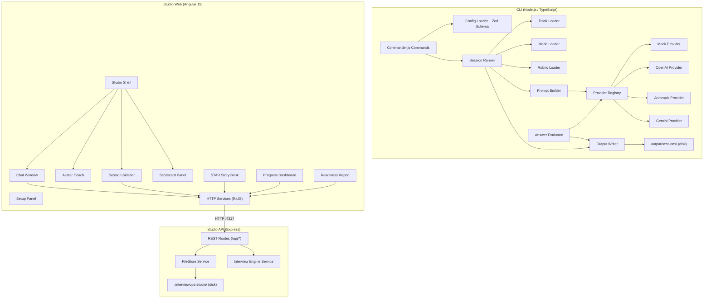
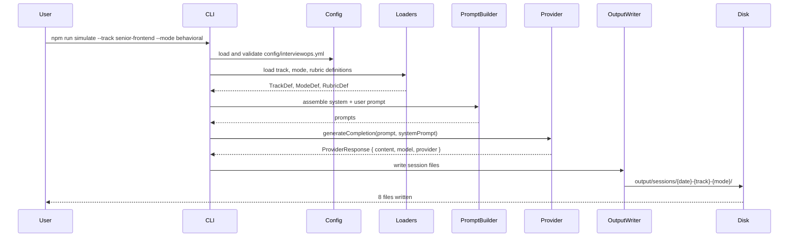

# InterviewOps Architecture

This document describes the technical architecture of InterviewOps v0.3.0. The system has three independent subsystems: the CLI, the Studio API, and the Studio Web app.

---

## System Overview



---

## CLI Architecture

The CLI is the core of InterviewOps. It is a TypeScript application compiled to ESM modules.

### Entry Point

`src/cli/index.ts` registers all commands with Commander.js and delegates to command handlers in `src/cli/`.

### Commands

| Command | Handler | What it does |
|---------|---------|--------------|
| `doctor` | `src/cli/` | Validates environment, config, dirs, provider availability |
| `init` | `src/cli/` | Creates config/interviewops.yml, input/, output/, .env |
| `simulate` / `start` | `src/cli/` | Runs a full mock interview session |
| `plan` | `src/cli/` | Generates a prep plan from resume and JD |
| `answer` | `src/cli/` | Evaluates a written answer against the session rubric |
| `verify` | `src/cli/` | Validates session output files |
| `tracks` | `src/cli/` | Lists available tracks |
| `modes` | `src/cli/` | Lists available modes |
| `providers` | `src/cli/` | Lists providers and availability |
| `examples` | `src/cli/` | Copies example input files to input/ |

### Interview Pipeline

When `simulate` runs, it executes this pipeline:

```
Track Loader  →  reads tracks/{track}.md, extracts metadata
Mode Loader   →  reads modes/{mode}.md, extracts metadata
Rubric Loader →  maps mode → rubric name, reads rubrics/{rubric}.md
Prompt Builder →  assembles the system prompt and user prompt for the provider
Session Runner →  calls Provider Registry → Provider, receives response content
Output Writer  →  splits response into individual files, writes session packet
```

Key source files:

| File | Responsibility |
|------|----------------|
| `src/interview/track-loader.ts` | Read and parse track Markdown files |
| `src/interview/mode-loader.ts` | Read and parse mode Markdown files |
| `src/interview/rubric-loader.ts` | Map mode → rubric, read rubric file |
| `src/interview/prompt-builder.ts` | Assemble prompts for the provider |
| `src/interview/session-runner.ts` | Orchestrate the full session pipeline |
| `src/interview/answer-evaluator.ts` | Score a written answer against the rubric |
| `src/interview/prep-plan-generator.ts` | Generate a 2-week prep plan |
| `src/output/` | Write and validate session output files |

---

## Provider System

The provider system decouples the interview pipeline from any specific AI backend.

### Interface

```typescript
export interface InterviewProvider {
  name: string;
  generateCompletion(prompt: string, systemPrompt?: string): Promise<ProviderResponse>;
  isAvailable(): boolean;
}
```

### Registry

`src/providers/provider-registry.ts` maintains a `Record<string, ProviderFactory>` mapping. `getProvider()` reads `INTERVIEWOPS_PROVIDER` from the environment, looks up the factory, instantiates the provider, and calls `isAvailable()`. If the provider is not available, it throws a `ProviderError` with a clear message — it never silently falls back.

### Providers

| Name | Key required | File |
|------|-------------|------|
| `mock` | No | `src/providers/mock.provider.ts` |
| `openai` | `OPENAI_API_KEY` | `src/providers/openai.provider.ts` |
| `anthropic` | `ANTHROPIC_API_KEY` | `src/providers/anthropic.provider.ts` |
| `gemini` | `GEMINI_API_KEY` | `src/providers/gemini.provider.ts` |

See [docs/provider-system.md](provider-system.md) for the full provider deep-dive.

---

## Configuration System

### Config File

`config/interviewops.yml` — YAML file read at startup by `src/config/config.loader.ts`.

### Zod Schema

`src/config/config.schema.ts` defines the full configuration schema using Zod. All fields have safe defaults. The schema is validated at startup; invalid config produces a human-readable error.

Key schema sections:

| Section | Key settings |
|---------|-------------|
| `project` | name, default_track, default_mode, output_dir, input_dir |
| `model` | provider, temperature, max_tokens |
| `interview` | duration_minutes, difficulty, style, include flags |
| `feedback` | tone, rubric_scale, hire signal flags |
| `ethics` | practice_only, block_live_cheating_features, include_ethics_notice, no_hidden_overlay, no_real_time_answer_injection |
| `tracks` | enabled list |
| `modes` | enabled list |

All `ethics` fields default to `true` and are enforced in tests.

### Environment

`.env` is loaded via `dotenv`. Required keys depend on the selected provider. See `.env.example` for all supported variables.

---

## Studio API Architecture

The Studio API is an Express.js application running at `http://localhost:4317`.

### Routes

All routes are registered under `/api`:

| Route prefix | Responsibility |
|-------------|----------------|
| `/api/health` | Health check |
| `/api/tracks` | List available tracks |
| `/api/modes` | List available modes |
| `/api/providers` | List providers and status |
| `/api/sessions` | CRUD for interview sessions |
| `/api/messages` | Chat message handling |
| `/api/profile` | Candidate profile (resume, JD) |
| `/api/reports` | Readiness reports |
| `/api/star-stories` | STAR story bank |
| `/api/dashboard` | Progress dashboard data |
| `/api/export` | Markdown export |
| `/api/plans` | Prep plans |
| `/api/premium-packs` | Premium question packs |

### Services

| Service | File | Responsibility |
|---------|------|----------------|
| `FileStore<T>` | `services/file-store.service.ts` | Generic typed JSON file persistence |
| `InterviewEngineService` | `services/interview-engine.service.ts` | Session and message orchestration |
| `SessionStoreService` | `services/session-store.service.ts` | Session-specific file operations |
| `ReadinessReportService` | `services/readiness-report.service.ts` | Generate readiness report |
| `StarStoryService` | `services/star-story.service.ts` | STAR story CRUD |
| `ProfileService` | `services/profile.service.ts` | Candidate profile persistence |
| `MockInterviewerService` | `services/mock-interviewer.service.ts` | Mock AI response generation |
| `AvatarStateService` | `services/avatar-state.service.ts` | Avatar state management |

### Persistence

All Studio data is stored in `.interviewops-studio/` in the project root. This directory is gitignored. `FileStore<T>` provides typed `getAll()`, `get(id)`, `save(item)`, and `delete(id)` operations backed by individual JSON files.

---

## Studio Web Architecture

The Studio Web is an Angular 19 application running at `http://localhost:4200`.

### Key design decisions

- **Standalone components** — no NgModules; components declare their own imports
- **Angular Signals** — `signal()`, `computed()`, and `effect()` for reactive state
- **RxJS** — HTTP client calls and async data streams use Observables
- **OnPush change detection** — used in performance-sensitive components

### Feature Components

| Component | Directory | Responsibility |
|-----------|-----------|----------------|
| Studio Shell | `features/studio-shell` | Root layout, coordinates all panels |
| Chat Window | `features/chat-window` | Conversational interview interface |
| Avatar Coach | `features/avatar-coach` | Animated SVG coach reacting to session state |
| Setup Panel | `features/setup-panel` | Track/mode/provider configuration |
| Session Sidebar | `features/session-sidebar` | Session history list |
| Scorecard Panel | `features/scorecard-panel` | Rubric score display |
| Readiness Report Panel | `features/readiness-report-panel` | Hire signal, weakness map, top actions |
| STAR Story Bank | `features/star-story-bank` | Create, store, retrieve STAR stories |
| Progress Dashboard | `features/progress-dashboard` | Cross-session score tracking |
| Study Plan Panel | `features/study-plan-panel` | 2-week prep plan view |

---

## Data Flow: User Input to Session Packet



---

## Session Output Structure

Every `simulate` command produces a directory at `output/sessions/{YYYY-MM-DD}-{track}-{mode}/` containing exactly 8 files:

| File | Purpose |
|------|---------|
| `session.md` | Full session: questions, scorecard, feedback, improved answers |
| `questions.md` | Interview questions and follow-up probes in isolation |
| `scorecard.md` | Rubric dimension scores (1–5), overall score, hire signal |
| `feedback.md` | Strengths (3–5), gaps (3–5), improvement paths |
| `improved-answers.md` | Before/after answer example with explanation |
| `study-plan.md` | 7-day and 14-day study plan with daily focus and resources |
| `ethics-notice.md` | Practice-only notice; present in every session without exception |
| `metadata.json` | Machine-readable session metadata (track, mode, date, provider, version) |

The `verify` command checks that all 8 files exist, the ethics notice is correct, and no banned phrases appear in content files.
