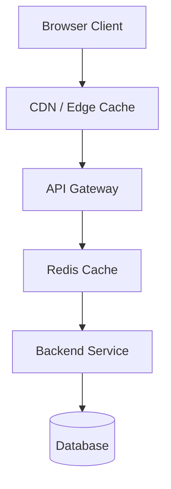

# Issue: Add System Design Diagram Mode

**Labels**: `good first issue`, `enhancement`, `system-design`  
**Milestone**: v0.3.0

---

## Summary

Extend the `system-design` interview mode to include Mermaid diagram stubs alongside questions, giving candidates a structured visual artifact to work from during practice.

---

## Background

System design interviews often involve whiteboard diagrams. Currently, InterviewOps generates questions and feedback but no visual component. Adding Mermaid diagram stubs would:
- Give candidates a starting point for visual thinking
- Produce a reviewable artifact (rendered in GitHub, VS Code, Obsidian)
- Make practice more realistic for companies that use virtual whiteboards

---

## Proposed Behavior

After a system design simulation, a `diagram.md` file is written to the session directory:

```
output/sessions/2026-05-13-senior-frontend-system-design/
  session.md
  questions.md
  scorecard.md
  feedback.md
  improved-answers.md
  study-plan.md
  ethics-notice.md
  diagram.md          ← NEW
  metadata.json
```

`diagram.md` contains a Mermaid diagram stub representing the system being designed:

````markdown
# System Design Diagram

## Proposed Architecture



## Components to Discuss

- **Client**: How does the frontend connect? WebSocket or polling?
- **CDN**: What gets cached? What's the invalidation strategy?
- **API Gateway**: Auth, rate limiting, routing?
- **Service**: Stateless or stateful? How does it scale horizontally?
- **Cache**: What's the eviction policy? How do you handle cache invalidation?
- **Database**: SQL or NoSQL? How do you handle read replicas?
```
````

---

## Acceptance Criteria

- [ ] System design sessions include `diagram.md`
- [ ] Diagram uses Mermaid syntax that renders in GitHub and VS Code
- [ ] Diagram is relevant to the simulated system (not generic)
- [ ] Mock provider generates appropriate diagrams for system design mode
- [ ] `npm run verify` updated to check for `diagram.md` in system-design sessions
- [ ] Documented in `docs/OUTPUTS.md`

---

## Files to Touch

- `src/output/output-writer.ts` — add `buildDiagramMd()` for system-design sessions
- `src/providers/mock.provider.ts` — generate mock diagrams for system-design mode
- `src/cli/commands/verify.command.ts` — optionally check for diagram.md in system-design sessions
- `docs/OUTPUTS.md` — document `diagram.md`
- `modes/system-design.md` — reference diagram output

---

## Notes

- The diagram should reflect the session's design question (e.g. "design a notification system" → notification system diagram)
- Start with 5–6 simple diagram templates that cover common system design topics
- Mermaid `graph TD` (top-down flowchart) works well for most system diagrams
